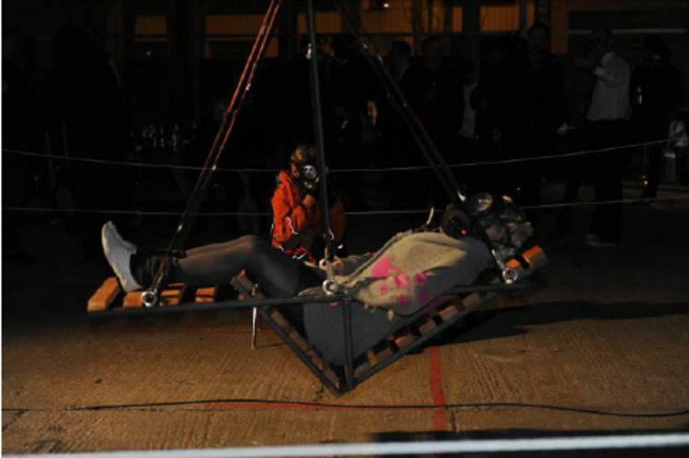
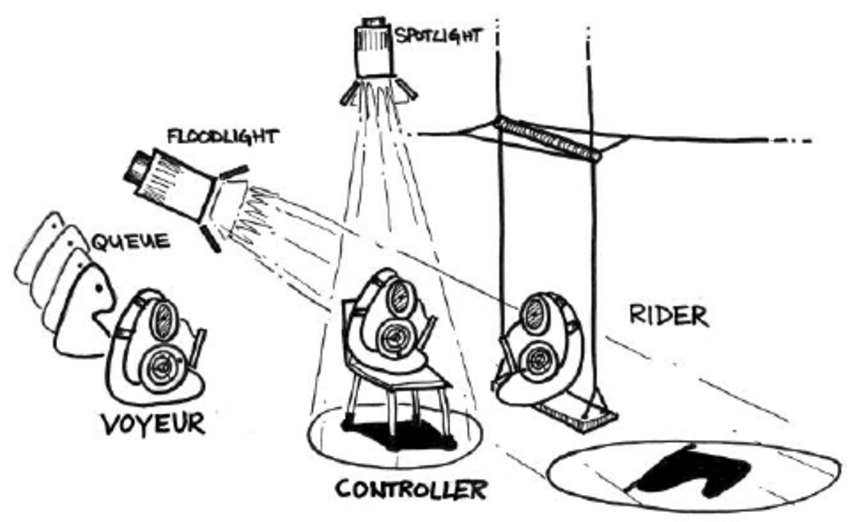

#### The Embodied Translation
##### IND209 Studio Mini Lecture
##### By *[Dr. Aven Le ZHOU](https://aven.cc)*, 2026

---

## A good question

A student asked:

<ul>
<li class="fragment"><strong class="highlight-blue">Does embodied feedback need to be uncomfortable by default?</strong></li>
</ul>

---

## My answer

# <strong class="fragment highlight-current-red">No</strong>

I want to follow up with:

<ul>
<li class="fragment">What types of embodied feedback should we design then?</li>
</ul>

---

### Not uncomfortable by default

### The default may be
## <strong class="fragment highlight-red">Frictional</strong> 
### verses frictionless / seamless

---

### Why not uncomforable

<ul>
<li class="fragment">easy to jump to punishment</li>
<li class="fragment">easy to confuse sensation with design</li>
<li class="fragment">easy to miss other possibilities</li>
</ul>

---

### The actual question should be:

## <strong class="fragment highlight-red">How do we embody consequence?</strong>

---

## The core inquiry

<strong class="fragment">How can embodied feedback be designed</strong>
<strong class="fragment">so that hidden infrastructural consequence</strong>
<strong class="fragment">becomes perceptible</strong>
<strong class="fragment">and behaviorally meaningful (for modulation)</strong>
<strong class="fragment">during AI use?</strong>

---

## Echoing our design studio goal

<ul>
<li class="fragment">not only reveal infrastructure</li>
<li class="fragment">translate it into embodied feedback</li>
<li class="fragment">modulate behavior through the loop / coupling</li>
</ul>

---

## Three concepts help

<ul>
<li class="fragment"><strong>slow technology / slow AI</strong> = broad background</li>
<li class="fragment"><strong>design friction</strong> = one design logic</li>
<li class="fragment"><strong>design discomfort</strong> = another deisgn logic</li>
</ul>

---

### The essence

## <strong class="fragment highlight-current-red">embodied translation</strong>

---

## What does that mean?

<ul>
<li class="fragment">translate a chosen planetary consequence into embodied feedback</li>
<li class="fragment">so it becomes perceptible in action and can modulate behavior</li>
</ul>

---

### Not this

## <strong class="fragment highlight-current-blue">Punish the user</strong>

---

### But this

## <strong class="fragment highlight-current-red">Embody consequence</strong>

---

## Slow technology / slow AI

<ul>
<li class="fragment">not only speed and efficiency</li>
<li class="fragment">also reflection</li>
<li class="fragment">also mental rest</li>
</ul>

<a href="https://link.springer.com/article/10.1007/PL00000019">Hallnäs &amp; Redström, 2001</a>

---

## Design friction 

<ul>
<li class="fragment">small intentional interruptions</li>
<li class="fragment">microboundaries</li>
<li class="fragment">mindful interaction</li>
</ul>

<a href="https://dl.acm.org/doi/10.1145/2851581.2892410">Cox et al., 2016</a>

---

## Design discomfort

<ul>
<li class="fragment">a valid tactic/strategy </li>
<li class="fragment">but not the universal model</li>
<li class="fragment">used when stronger bodily force is needed</li>
</ul>

<a href="https://dl.acm.org/doi/10.1145/2207676.2208347">Benford et al., 2012</a>

---

#### Case — Slow Game

<iframe width="560" height="315" src="https://www.youtube.com/embed/lKA6WJX3GJk?si=E9l4lwh1FqsGxP5n&amp;start=415" title="YouTube video player" frameborder="0" allow="accelerometer; autoplay; clipboard-write; encrypted-media; gyroscope; picture-in-picture; web-share" referrerpolicy="strict-origin-when-cross-origin" allowfullscreen></iframe>

##### What it is
<ul>
<li class="fragment">a slow technology research product</li>
<li class="fragment">a small cube game unfolding over long time</li>
</ul>

##### What it does
<ul>
<li class="fragment">one move about every 18 hours</li>
<li class="fragment">challenges memory, patience, observation</li>
</ul>

##### What to borrow
<ul>
<li class="fragment">pace itself can be the design material</li>
<li class="fragment">interaction does not need instant response</li>
<li class="fragment">slowness can shape attention</li>
</ul>

Odom et al., 2019

---

#### Case — Obscura 1C

##### What it is
<ul>
<li class="fragment">a counterfunctional digital camera</li>
<li class="fragment">media can only be accessed by breaking it open</li>
</ul>

##### What it does
<ul>
<li class="fragment">turns convenience into uncertainty, patience, surprise</li>
<li class="fragment">makes limitation itself the feature</li>
</ul>

##### What to borrow
<ul>
<li class="fragment">anti-efficiency can be material</li>
<li class="fragment">remove convenience to create another value</li>
</ul>

<a href="https://jamesjpierce.com/projects/project-h">Pierce &amp; Paulos, 2015</a>

---

#### Case — one sec

<iframe width="560" height="315" src="https://www.youtube.com/embed/JnnCoIzulLA?si=ZraloWwXDuHVEKoc" title="YouTube video player" frameborder="0" allow="accelerometer; autoplay; clipboard-write; encrypted-media; gyroscope; picture-in-picture; web-share" referrerpolicy="strict-origin-when-cross-origin" allowfullscreen></iframe>

##### What it is
<ul>
<li class="fragment">a smartphone intervention for overuse</li>
<li class="fragment">adds a short interruption before opening an app</li>
</ul>

##### What it does
<ul>
<li class="fragment">inserts a microboundary into habit loops</li>
<li class="fragment">supports more intentional app opening over time</li>
</ul>

##### What to borrow
<ul>
<li class="fragment">friction can be tiny but effective</li>
<li class="fragment">a pause can break automaticity</li>
<li class="fragment">microboundary first, stronger embodiment later</li>
</ul>

Haliburton et al., 2024

---

<iframe width="1120" height="630" src="https://www.youtube.com/embed/0njQpBwx9mo?si=7BECv3mNXBNtT0VY" title="YouTube video player" frameborder="0" allow="accelerometer; autoplay; clipboard-write; encrypted-media; gyroscope; picture-in-picture; web-share" referrerpolicy="strict-origin-when-cross-origin" allowfullscreen></iframe>

---

#### Case — Breathless

##### What it is
<ul>
<li class="fragment">a swing controlled through breathing in a gas mask</li>
<li class="fragment">a key example from uncomfortable interactions</li>
</ul>

##### What it does
<ul>
<li class="fragment">makes the body the control channel</li>
<li class="fragment">uses fear, strain, unease, voyeurism</li>
</ul>

#### What to borrow
<ul>
<li class="fragment">discomfort is a deliberate tactic</li>
<li class="fragment">it is stronger and more ethically charged</li>
<li class="fragment">not default — only when conceptually necessary</li>
</ul>

Benford et al., 2012

---

## The framework

<ul>
<li class="fragment"><strong>slow technology / slow AI</strong> = background</li>
<li class="fragment"><strong>design friction</strong> = one anchor</li>
<li class="fragment"><strong>design discomfort</strong> = another anchor</li>
<li class="fragment"><strong>embodied translation</strong> = our studio task</li>
</ul>

---

### Our studio move

### <strong class="fragment highlight-current-red">embodied translation</strong>

---

### Now make it designable

## Three embodied orientations

---

## These are not stages

<ul>
<li class="fragment">not three levels of escalation</li>
<li class="fragment">three different ways embodied translation can operate</li>
</ul>

---

#### Orientation 1

## Embodied friction

---

#### Orientation 1 means

<ul>
<li class="fragment">threshold</li>
<li class="fragment">delay</li>
<li class="fragment">pacing</li>
<li class="fragment">resistance</li>
<li class="fragment">effort</li>
</ul>

---

#### Orientation 1 examples

<ul>
<li class="fragment">longer hold to send</li>
<li class="fragment">forced cooldown</li>
<li class="fragment">stiffening dial</li>
<li class="fragment">heavier press</li>
</ul>

---

#### Orientation 2

## Embodied salience

---

#### Orientation 2 means

<ul>
<li class="fragment">bodily noticeability</li>
<li class="fragment">warmth</li>
<li class="fragment">vibration</li>
<li class="fragment">weight</li>
<li class="fragment">posture shift</li>
</ul>

---

#### Orientation 2 examples

<ul>
<li class="fragment">warmth building in the hand</li>
<li class="fragment">intensifying vibration</li>
<li class="fragment">local weight shift</li>
<li class="fragment">reach becoming constrained</li>
</ul>

---

#### Orientation 3

## Embodied discomfort

---

#### Orientation 3 means

<ul>
<li class="fragment">deliberate unease</li>
<li class="fragment">awkward strain</li>
<li class="fragment">irritating resistance</li>
<li class="fragment">sustained loss of ease</li>
</ul>

---

#### Orientation 3 needs

<ul>
<li class="fragment">clear justification</li>
<li class="fragment">conceptual necessity</li>
<li class="fragment">ethical care</li>
</ul>

---

### Compare the three orientations

#### Orientation 1

<ul>
<li class="fragment">embodied friction</li>
<li class="fragment">threshold</li>
<li class="fragment">delay</li>
<li class="fragment">slight effort</li>
</ul>

#### Orientation 2

<ul>
<li class="fragment">embodied salience</li>
<li class="fragment">warmth</li>
<li class="fragment">vibration</li>
<li class="fragment">tension</li>
</ul>

#### Orientation 3

<ul>
<li class="fragment">embodied discomfort</li>
<li class="fragment">irritation</li>
<li class="fragment">awkward strain</li>
<li class="fragment">strong loss of ease</li>
</ul>

---

## So how to design it?

<ul>
<li class="fragment">what behavior are you focusing on?</li>
<li class="fragment">what planetary consequence are you translating?</li>
<li class="fragment">which embodied orientation does the translation take?</li>
<li class="fragment">what embodied feedback matches that consequence?</li>
</ul>

---

#### Question 1:

### what behavior are you focusing on?

---

#### Question 2:

### what planetary consequence are you translating?

---

### Possible consequences

<ul>
<li class="fragment">water consumption</li>
<li class="fragment">heat discharge</li>
<li class="fragment">carbon emission</li>
<li class="fragment">...</li>
</ul>

---

#### Question 3:

### which embodied orientation does the translation take?

---

### Choose the orientation

<ul>
<li class="fragment">embodied friction</li>
<li class="fragment">embodied salience</li>
<li class="fragment">embodied discomfort</li>
</ul>

---

#### Question 4:

### what embodied feedback matches that consequence?

---

#### A good embodied translation is <strong class="fragment, highlight-current-red"> the one that best matches a chosen planetary consequence to embodied feedback</strong>

---

### What I am expecting

<ul>
<li class="fragment">The studio asks for <strong>embodied translation</strong></li>
<li class="fragment"><strong>embodied friction</strong> and <strong>embodied salience</strong> will likely be the most common directions</li>
<li class="fragment"><strong>embodied discomfort</strong> remains possible when justified</li>
<li class="fragment"><strong>slow AI</strong> remains the broader background</li>
</ul>

---

### Final takeaway

### Do not begin from punishment, begin from embodied translation

---

## Next

<ul>
<li><s>identify one behavior pattern</s></li>
<li><s>choose its planetary consequence</s></li>
<li class="fragment">choose the orientation and design the embodied feedback</li>
</ul>

---

## References

Hallnäs, L., &amp; Redström, J. (2001). <a href="https://link.springer.com/article/10.1007/PL00000019"><em>Slow Technology – Designing for Reflection</em></a>. <em>Personal and Ubiquitous Computing, 5</em>(3), 201–212.  
Cox, A. L., Gould, S. J. J., Cecchinato, M. E., Iacovides, I., &amp; Renfree, I. (2016). <a href="https://dl.acm.org/doi/10.1145/2851581.2892410"><em>Design Frictions for Mindful Interactions: The Case for Microboundaries</em></a>. In <em>CHI EA ’16</em>.  
Benford, S., Greenhalgh, C., Giannachi, G., Walker, B., Marshall, J., &amp; Rodden, T. (2012). <a href="https://dl.acm.org/doi/10.1145/2207676.2208347"><em>Uncomfortable Interactions</em></a>. In <em>CHI ’12</em>.  
Park, J. S., Barber, R., Kirlik, A., &amp; Karahalios, K. (2019). <a href="https://dl.acm.org/doi/10.1145/3359204"><em>A Slow Algorithm Improves Users’ Assessments of the Algorithm’s Accuracy</em></a>. <em>PACM HCI, CSCW</em>.

